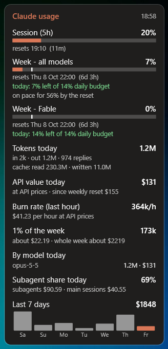
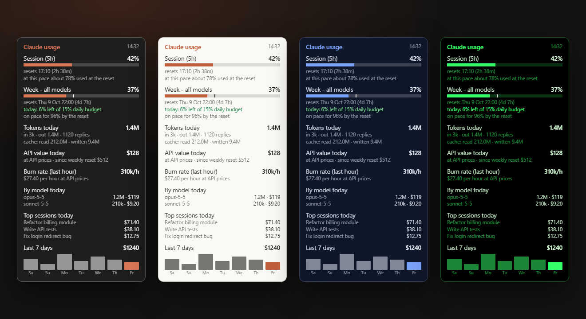

# Claude Usage Widget: Claude Code usage monitor for Windows

[](https://f3s0j.github.io/claude-usage-widget/)
[](LICENSE)


**See your Claude Code rate limits, token usage and cost without typing `/usage`.**
Website with a live preview: **https://f3s0j.github.io/claude-usage-widget/**

A small always-on-top Windows widget that shows your **Claude subscription usage**: the
5-hour session, the weekly limit, and any per-model weekly limit. These are the same
numbers `/usage` shows in Claude Code, without typing `/usage`. Below the bars it shows
a **daily budget** for the weekly limit and **token statistics** read from your local
Claude Code transcripts. It also adds a global **F9** hotkey that shows or hides your
Claude Code terminal.



One PowerShell file plus one C# file it compiles at start. No install, no dependencies
beyond what ships with Windows.

Four themes, adjustable transparency and size (example numbers):



## Who it is for

- You use Claude Code on a **Claude Pro or Max** plan and keep hitting the **5-hour
  session limit** or the **weekly limit** without warning.
- You want to **use the whole weekly limit** without running out before the reset.
- You want to know **how many tokens** your agents and subagents burn, and what that
  would **cost on the API**.
- You want a usage tracker that is always visible instead of a command you have to run.

## What it does

- **Usage bars.** Every limit your plan has gets a bar with the percentage and the
  time until it resets. The bar turns amber at 60 % and red at 85 %. It refreshes
  every 2 minutes; double-click refreshes now.
- **F9: Claude terminal on/off.** F9 brings your Claude Code window to the front,
  or minimizes it if it is already in front. If there is none, it opens one
  (`wt -w claude new-tab … claude`). **Shift+F9** opens another Claude tab in that
  same window.
- **Survives rate limits and restarts.** Every good answer is saved to
  `last-usage.json`. If the server says "too many requests", the widget shows the
  saved numbers with their time, waits longer before the next try (the server's
  `Retry-After`, otherwise doubling up to 15 min), and returns to normal after the
  next success. "offline" only appears for real errors.
- Drag it anywhere; it remembers the spot. Right-click → Refresh / Exit.
- **Daily budget.** Each weekly row says how much of the week you can still spend
  today, e.g. `today: 7% left of 14% daily budget`, and a tick on the bar marks where
  the bar should be by midnight. The budget is what was free when the day began, spread
  evenly over the time until the reset, so an unused share rolls into the next days.
- **Pace forecasts.** "on pace for 56% by the reset" for the week; for the 5-hour
  session, when it will be full at the current pace.
- **Token statistics** (from the transcripts on this PC, refreshed every 15 seconds,
  no extra server requests):
  - tokens today (input, output, cache read and written, number of replies)
  - API value: what the same usage would cost at API list prices
  - burn rate over the last hour
  - tokens per 1 % of the weekly limit
  - split by model, share used by subagents, top sessions of the day
  - a bar chart of the last 7 days
- **Preferences.** Right-click → Preferences… switches every block on or off.
- **Look.** Right-click → Theme (Dark, Light, Midnight, Terminal), Transparency, Size.
  Ctrl + mouse wheel resizes in 10 % steps. Choices are saved in `settings.json`.

## Requirements

- Windows 10 or 11, Windows PowerShell 5.1 (built in)
- [Claude Code](https://claude.com/claude-code) logged in with a Claude subscription
  (Pro / Max). On Windows it keeps its login in `%USERPROFILE%\.claude\.credentials.json`,
  which is what the widget reads.
- Windows Terminal (`wt.exe`) for the F9 hotkey

## Install

```powershell
git clone https://github.com/F3S0J/claude-usage-widget.git
cd claude-usage-widget
powershell -ExecutionPolicy Bypass -File .\install-shortcuts.ps1
```

This creates a **Claude Usage** shortcut on the Desktop and in the Startup folder, so the
widget starts with Windows. Double-click the Desktop shortcut to start it now.
`start-widget.vbs` launches it without a console window.

To remove it, right-click the widget → Exit, then delete the two shortcuts.

## Settings

At the top of `widget.ps1`:

| Variable    | Default         | Meaning                                         |
|-------------|-----------------|-------------------------------------------------|
| `$PollSec`  | `120`           | seconds between refreshes                       |
| `$HotKeyVk` | `0x78` (F9)     | [virtual-key code](https://learn.microsoft.com/windows/win32/inputdev/virtual-key-codes) of the hotkey |
| `$ClaudeDir`| `%USERPROFILE%` | folder new Claude sessions start in             |

## How it works, and what to know

- It calls `GET https://api.anthropic.com/api/oauth/usage` with the OAuth access token
  Claude Code already has, plus the header `anthropic-beta: oauth-2025-04-20`. This is
  the endpoint `/usage` uses. **It is not a documented public API**, so it can change
  or disappear without notice.
- **The token is only read, never refreshed.** Refreshing would rotate the refresh token
  and could log Claude Code out. If the token expires while Claude Code is closed, the
  widget says so until you open Claude Code once.
- The token never leaves your machine except in that one request to `api.anthropic.com`.
- **The endpoint is rate-limited.** Restarting the widget over and over or spamming
  double-click will get you a 429 for a while. The widget copes, but don't poll faster
  than the default.
- **Token statistics are local and approximate.** `TokenScan.cs` reads
  `%USERPROFILE%\.claude\projects\**\*.jsonl` on a background thread and only reads what
  was appended since the last scan. Usage on claude.ai or on another machine is not in
  those files, so "tokens per 1 %" is an estimate. Dollar figures use the list prices
  hard-coded in `Price()` in `TokenScan.cs`, with cache writes at 1.25× (5-minute) and 2×
  (1-hour) the input price. Update them when prices change. Nothing is billed.
- **The daily budget needs one day to settle.** On the first run it cannot know what was
  used before it started, so the first day's figure counts from that moment.
- **F9 is a global hotkey.** While the widget runs, F9 no longer reaches other apps
  (e.g. recalculation in Excel). Change `$HotKeyVk` if you need F9.
- If you start the widget from *inside* a Claude Code session, it removes the
  `CLAUDE_CODE*` environment variables it inherited. Otherwise the terminals it opens
  would run as child sessions.

Not affiliated with Anthropic.

## License

MIT
